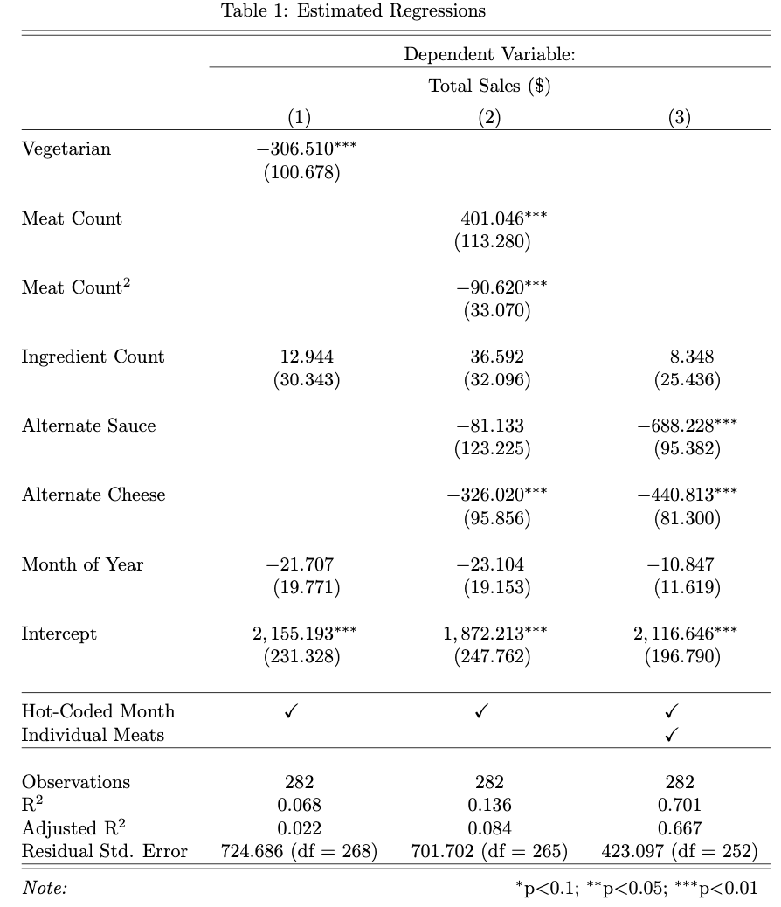

```{=tex}
\newpage
\setcounter{page}{1}
```
```{r setup, include=FALSE}
knitr::opts_chunk$set(echo = TRUE)
```

```{r packages, echo = FALSE, message=FALSE}
library(tidyverse)
library(dplyr)
library(ggplot2)
library(readxl)
library(gridExtra)
library(lubridate)
library(mltools)
library(data.table)
```

```{r, echo = FALSE, message = FALSE, show_col_types = FALSE}

# Load In Data
model <- read_csv("../data/processed/model_data.csv")
explore<- read_csv("../data/processed/explore_data.csv")

```

# Introduction

Restaurants belong in a competitive industry where success is determined by a delicate balance of food quality, service, and financial judgement. To understand financial decisions restaurants need to carefully manage costs, employ strategic pricing strategies, and maximize sales. With technology continuing to grow and impact our everyday lives, it can be beneficial for non-data driven industries, such as restaurants, to involve data into their decision making. One possibility to do so is to leverage order data to enhance sale strategies and overall performance. By analyzing order histories, restaurants might be able to unravel valuable insights into customer preferences, ordering patterns, and popular menu items. Understanding customer behaviors through this data can allow restaurants to tailor their offerings, optimize menus, and strategically price items. For pizza restaurants, analyzing the correlation between pizza ingredients and sales can reveal valuable insights into customer preferences and optimize their offerings optimally. Understanding the impact of pricing alongside ingredient combinations can guide decisions on pricing strategies or seasonal promotions, ultimately boosting sales and customer satisfaction.

The goal of this study is to estimate what types of ingredients can significantly influence pizza sales, by using artificial data for a pizza restaurant. By running a set of regression models, we attempt to estimate the values that pizza ingredients have on pizza sales.

# Data and Methodology

The data in this study is a data set made for Plato's Pizza, a fictitious pizza restaurant based in New Jersey. It was made publicly available by a group called Maven Analytics. It includes about a year's worth of 48620 pizza orders, where each row shows the details about the order such as date and time, number of pizzas, type of pizzas, size, quantity, price, and ingredients.

To organize and operationalize sales for the data, individual pizza orders were aggregated into monthly sales per type of pizza. Then, pizza ingredients were split into their respective categories of meat, sauce, cheese, and vegetables. For each pizza, the counts of each ingredient category was then tallied. To account for time series nature of the data (month over month sales), we decided to both one hot encode an indicator for each month and include an integer representation of month (1-12) for our regression models. These variables allow for the model to account for both individually more or less popular months as well as general trends in popularity (sales) throughout the year. After organizing the data in this manner, we then used a random probability sampling method to split the data into either an exploratory data set (with 25% probability) for exploratory data analysis and feature engineering and a modeling data set (with 75% probability) used for our regression analysis. In our final data sets, each data point represents a single type of pizza in a particular month and its associated sales and ingredient information. The final exploration and model building data sets had 102 and 283 data points respectively.

# An Explanation of Key Modeling Decisions

## Observations Removed:

No observations were intentionally removed from the dataset. The analysis was able to be conducted on the complete dataset available for Plato's Pizza, and no observations were excluded due to missing values or other criteria.

## Variable Transformations:

The source dataset we are pulling from contains individual orders from the restaurant so the first step we took was aggregating the data into monthly sales per type of pizza. To do this we used the 'pizza_name' variable to organize pizza sales by the type of pizza and the 'month' variable to aggregate monthly pizza sales. We then created a pizza ingredient categorization table that labeled each ingredient as either a meat, vegetable, alternative sauce, alternative cheese, or other. Using this table and the ingredients list of each type of pizza, we totaled up how many of each ingredient category each pizza contains (ie. a bbq chicken pizza contains one meat, four vegetables, one alternative sauce, and zero alternative cheeses).

After creating the data as described above, we began our exploratory data analysis on the exploratory split of the data set. This yielded a number of additional findings for feature engineering. Lead by our EDA, we created indicators for whether or not a pizza is vegetarian, contains any alternative cheese (not just mozzarella), or contains an alternative sauce (not just red sauce). We also observed that the relationship between number of meats on a pizza and sales appeared non-linear and thus we elected to include a squared term on number of meats in order to capture the apparent curvature in the relationship.

## Intentional Covariate Exclusions:

The only covariates that were removed was the month of January as the months were one hot encoded from month_01 to month_12. Otherwise, the transformed dataset includes relevant variables for the analysis, such as counts and indicators of ingredient categories: meat, alternative cheese, alternative sauce, vegetable, and a squared term. The inclusion of these variables aligns with the research question and allows for a comprehensive analysis of pizza sales based on the number of meats accounting for potential covariates where possible.

# A Table or Visualization

```{r, echo = FALSE, message = FALSE, show_col_types = FALSE}

# Basic Model Boxplot
basic_boxplot <- ggplot(explore, aes(x = reorder(is_vegetarian, desc(is_vegetarian)), y = total_sales)) +
  geom_boxplot(fill = "skyblue", alpha = 0.7) +
  labs(title = "Basic Model: Sales for Vegetarian vs Non-Vegetarian Pizzas",
       x = "Vegetarian Pizza",
       y = "Total Sales") +
  theme_minimal() + theme(plot.margin=unit(c(0,.25,0,0), "cm")) +
  theme(plot.title = element_text(hjust = .5)) +
  theme(plot.title = element_text(vjust = -1)) +
  theme(axis.title.x = element_text(vjust = 5.5))
```

The box plot analysis in the top in Figure 1 indicates that, on average, non-vegetarian pizzas tend to have higher Total Sales compared to vegetarian pizzas. While medians provide insights into the central tendency, the spread of the box plot and the presence of outliers suggest that the distribution of Total Sales is broader for non-vegetarian pizzas. This finding could guide further investigations into the factors influencing Total Sales for each category, helping restaurant owners make informed decisions about their pizza offerings.

```{r, echo = FALSE, message = FALSE}

# Unused Scatterplot
scatterplot <- ggplot(explore, aes(x = meat_count, y = total_sales, color = meat_count)) +
  geom_point(size = 3, alpha = 0.7) +
  geom_smooth(method = "lm", se = FALSE, linetype = "solid", color = "blue") +
  labs(title = "Advanced Model: Sales by Number of Meats on Pizza",
       x = "Meat Count",
       y = "Total Sales",
       color = "Number of Meats") +
  theme_minimal() + theme(legend.position = "none")
```

The boxplot in the lower half of Figure 1 provides a summary of the distribution of Total Sales across different Meat Counts. The boxplot indicates that the median Total Sales increase with the Meat Count up to 2, where it reaches a peak. Beyond 2 meats, the median Total Sales start to decline. While there is a positive linear trend between Meat Count and Total Sales, the relationship is clearly non-monotonic. This plateau and subsequent decline in median Total Sales beyond 2 meats suggest that there may be an optimal range of Meat Count for maximizing Total Sales and led to an inclusion of a Meat Count squared variable in our model regression.

```{r test_fig, echo = FALSE, message = FALSE, fig.cap = "Box plots of aggregated pizza sales for the basic and advanced models"}

# Advanced Model Boxplot
boxplot <- ggplot(explore, aes(x = factor(meat_count), y = total_sales)) +
  geom_boxplot(fill = "skyblue", alpha = 0.7) +
#  geom_smooth(method = "lm", se = FALSE, linetype = "solid", color = "deepskyblue", aes(group=1)) +
#  geom_segment(aes(x_points, y_points)) +
  labs(title = "Advanced Model: Sales by Number of Meats on Pizza", x = "Number of Meats",
       y = "Total Sales") +
  theme_minimal() + theme(plot.margin=unit(c(.25,0,0,0), "cm")) +
  theme(plot.title = element_text(hjust = .5)) +
  theme(plot.title = element_text(vjust = -1)) 

grid.arrange(basic_boxplot, boxplot, nrow=2,heights=c(2,2))
```

```{r, message = FALSE, echo = FALSE, warning = FALSE, fig.cap="Summary of correlation value between specific meat type and total sales in decending order"}
meat_columns <- c("meat_sliced_ham", "meat_pepperoni", "meat_bacon", "meat_calabrese_salami", 
                  "meat_barbecued_chicken", "meat_italian_sausage", "meat_chorizo_sausage", 
                  "meat_prosciutto", "meat_慛duja_salami", "meat_pancetta", "meat_chicken", 
                  "meat_beef_chuck_roast", "meat_capocollo", "meat_genoa_salami", 
                  "meat_prosciutto_di_san_daniele", "meat_coarse_sicilian_salami", 
                  "meat_luganega_sausage", "meat_soppressata_salami")


# Calculate correlation between each meat column and sales
correlations <- sapply(meat_columns, function(col) cor(explore$total_sales, explore[[col]]))

# Create a data frame for plotting
correlation_data <- data.frame(meat = meat_columns, correlation = correlations)

# Sort the data frame by correlation values
correlation_data <- correlation_data[order(correlation_data$correlation, decreasing = TRUE), ]

# Bar chart
ggplot(correlation_data, aes(x = reorder(meat, -correlation), y = correlation)) +
  geom_bar(stat = "identity", fill = "skyblue", color = "black") +
  labs(title = "Correlation between Meat Types and Sales",
       x = "Meat Types",
       y = "Correlation with Sales") +
  theme_minimal() +
  theme(axis.text.x = element_text(angle = 90, vjust = 0.5, hjust=1))

```

# Results

## Basic Model: Vegetarian or not

```{r, message = FALSE, echo = FALSE, warning = FALSE}

model1 <- lm(total_sales ~ is_vegetarian + ingredeint_count + month + month_02 + month_03 + month_04 + month_05 + month_06 + month_07 + month_08 + month_09 + month_10 + month_11 + month_12, data = model)
#summary(model1)
```

## Advanced Model: Number of meats

```{r, message = FALSE, echo = FALSE, warning = FALSE}

model2 <- lm(total_sales ~ meat_count + meat_count2 + ingredeint_count + alt_sauce + alt_cheese + month + month_02 + month_03 + month_04 + month_05 + month_06 + month_07 + month_08 + month_09 + month_10 + month_11 + month_12, data = model)
#summary(model2)
```

Table 1 provides a comprehensive summary of our basic and advanced regression models. Our basic model included a vegetarian indicator, ingredient count, and month information, while the advanced version included linear and quadratic terms for the number of meats on a pizza, as well as accounting for alternate sauces and alternate cheeses. Across both models, the addition of meats had a highly statistically significant impact on total sales. In the basic model, the vegetarian indicator coefficient was observed at -307, implying that for a hypothetical pizza with a fixed ingredient count, offering a non-meat option will lower the total sales by approximately \$307 per month compared to a pizza with meat.

For the advanced model, both the linear and quadratic meat count terms were highly significant, as well as the alternate cheese indicator. The linear term for meat count has positive coefficient, while the squared term has a negative coefficient. The interaction of these terms suggests that initially, adding more meats to a pizza increases sales, but after a certain number of meats, the incremental benefit decreases and eventually turns negative. To frame this in an example, the marginal benefit of going from 0 meats on a pizza to 1 meat on a pizza is $\$401\cdot 1 - \$91 \cdot 1^2 = \$301$ increase in monthly sales. However, transitioning from a pizza with 3 meats to a pizza with 4 meats, results in a marginal difference of $(\$401\cdot 4 - \$91 \cdot 4^2) - (\$401\cdot 3 - \$91 \cdot 3^2) = -\$236$ decrease in totals sales. Based on the model, the optimal number of meats on a pizza is 2, as any increase beyond this number is associated with a negative impact on total sales.

Additionally, the alternate cheese indicator coefficient was highly significant with a value of -\$326, indicating that pizzas with cheese other than mozzarella sell \$326 less per month than pizzas with mozzarella cheese. Notably, the month of sale did not have any significant impact on total sales.

```{r my_image_chunk, fig.show='left', out.width='40%', fig.cap="", echo=FALSE}

```

# Discussion of Limitations

Concerns regarding the i.i.d assumption arise due to several factors. Primarily, there is a time series nature of grouping the total sales by month. Pizza sales of one month could influence pizza sales of the next month due to factors like customer retention or word-of-mouth. We attempt to account for this by including control variables in the model. Specifically, we hot-code the individual months to account for month-to-month variation, and add a month number variable to capture the time ordering component.

Secondly, there is the potential of geographic clustering as we do not have location data in this dataset. Geographical groupings could influence pizza sales by reflecting regional or local sales trends. Additionally, there is the possibility of repeat customers in the database, which may not represent a random sampling and could skew the results towards repeat customers' personal preferences. Finally, the dataset does not specify if promotions or discounts occurred during the sampling. Promotions can change the underlying sampling distribution since a heavier weight with will be applied towards whichever pizza is currently discounted.

Regarding structural limitations, the validity of our estimates on the impact of meat pizza sales may be biased by several omitted variables. An example of such a variable is religion. Many religions tend to restrict meat consumption, which will negatively correlate with the amount meat on pizzas. Additionally, religions tend to emphasize healthier diets and could have a negative correlation with total pizza sales. Therefore, we anticipate a positive omitted variable bias due to religion, which would result in a bias away from zero.

Income level is another variable to consider. Affluent consumers may be able to afford the premium or meat-heavy pizzas, which results in a positive correlation with meat consumption. However, wealthier demographics tend to eat healthier foods, and thus overall pizza sales may decline, resulting in a negative correlation. Therefore, we predict a negative omitted variable bias, resulting in a bias towards zero, underestimating the impact of meat on pizza sales.

One final example - which is challenging to pinpoint bias directionality for - is the impact of marketing. Effective marketing can be assumed to increase the sales of the marketed pizza, regardless of the meat content. We assume this will have a positive correlation with total pizza sales but could have a positive or negative correlation with meat consumption depending on whether meat or vegetarian pizzas were marketed. Therefore, this could lead to a positive or negative bias, depending on which marketing strategy that was employed.

# Conclusion

This study evaluated the impact of meat on total pizza sales. The regression models predict that pizzas with meat will increase sales by \$307 per month, and that the optimal number of meats on a pizza is 2. Beyond that value, pizza sales will begin to diminish. Additionally, swapping out alternate cheese for mozzarella cheese will reduce sales by approximately \$326 per month.

In future research, we would recommend collecting a more comprehensive dataset to investigate impact of meat on sale for broader topics like regional differences or pizza chain-level differences.  The intended goal of this work is to help restaurant owners and chef's curate to drive overall sales for their establishments.  Adding more depth to the analysis through those additional variables could enhance the impact of the work.
